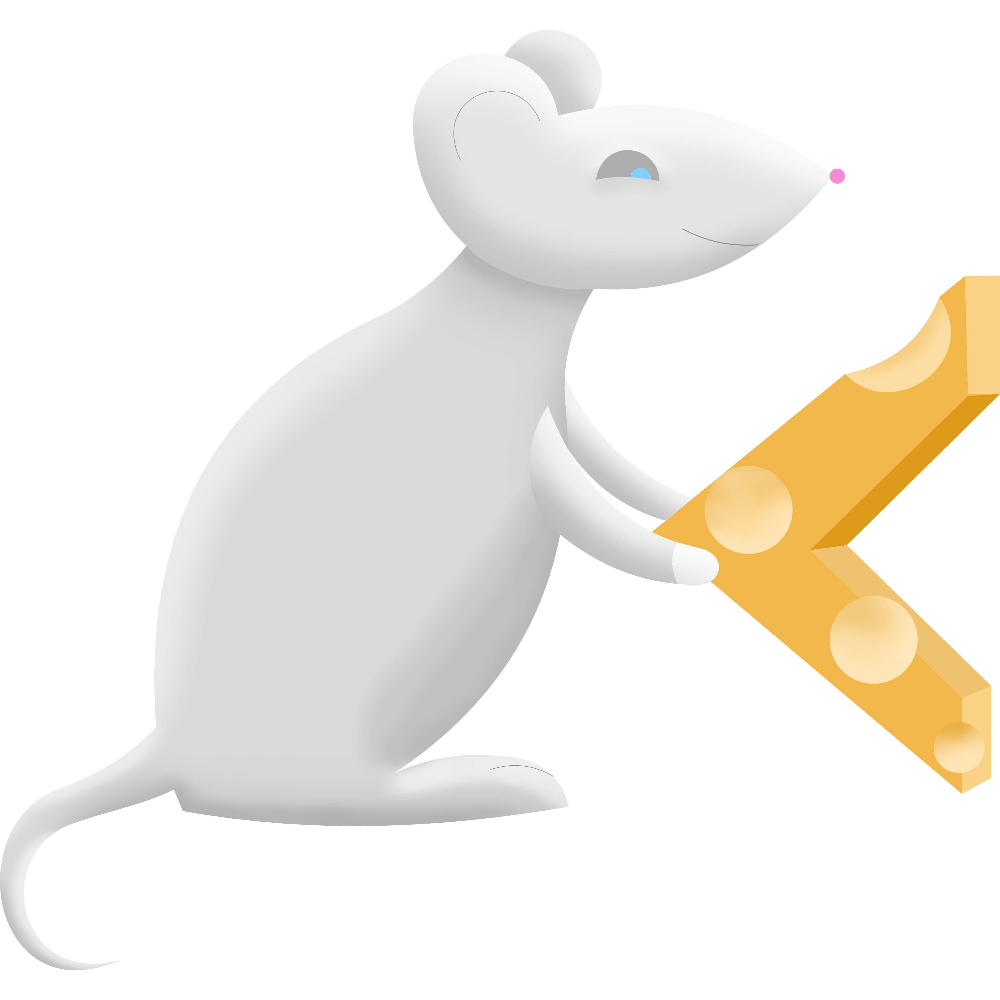
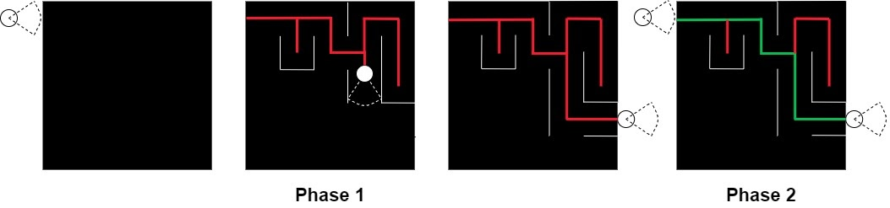
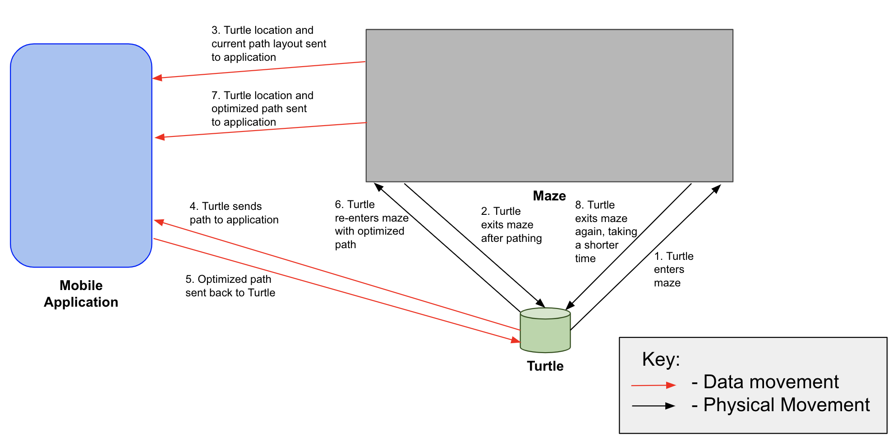
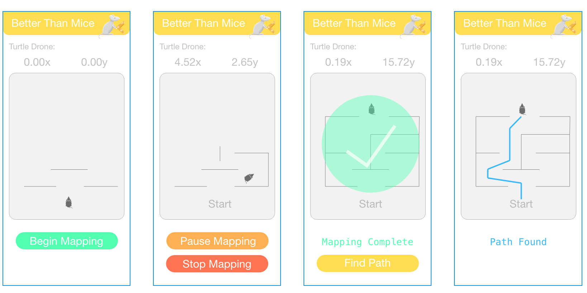

# BetterThanMice

## By

Isaiah Ritter (iritter@nd.edu)  
Luke Siela (lsiela@nd.edu)  
Eric Tsai (ctsai@nd.edu)

## Vision Statement

- Phase One

  - TurtleBot explores an unknown maze from a fixed starting point to reach to our target point, and returns the traveling pattern information.

- Phase Two
  - Based on the returned pattern, we created an algorithm to optimize this path. We again send the turtlebot to the maze from the same starting point. This time the turtlebot should reach to the same fixed target point with less traveling time.

## Key Requirements

- Ubiquitous
  - No Turtle should hit a cardboard wall of the cardboard maze.
  - The Turtle’s goal is to exit the maze.
  - A mobile application should be used as input to communicate with Turtle.
  - The same mobile application should be used as output to display pathing and Turtle position.
- Event-Driven
  - When the Turtle exits the maze, calculate optimal pathing and communicate the pathing to the application.
- State-Driven
  - While the Turtle is traversing the maze the first time, use SLAM only and map the path.
  - While the Turtle is traversing the maze the second time, it should follow the optimal pathing found by the Turtle on the first run, while using SLAM as support (so that it isn’t following blindly).
  - Display SLAM data on mobile application in 2D form so the user can see the Turtle’s current position within the maze, along with the pathing.

## High Level Architecture

## User Interface Screen

